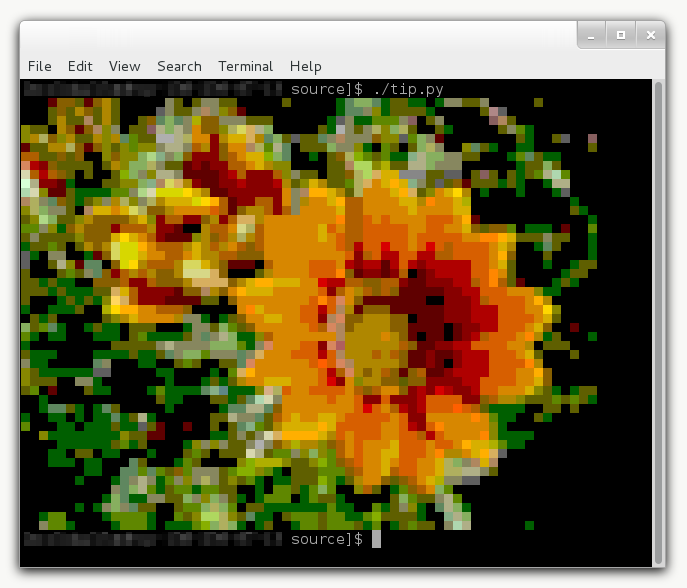

# Terminal Image Preview
Python script to preview images as text in the terminal

Description
-----------
Terminal Image Preview is a simple python script that opens an image file (JPG/PNG/GIF) and displays the image as a low-resolution printout using ANSI 256 colors in a terminal window. This can be useful when trying to find a poorly named image file remotely over SSH, for example.

Dependencies
------------
Terminal Image Preview uses the Python Image Library (PIL) to open and modify images. The official PIL website can be found here: http://www.pythonware.com/products/pil/.

Sample Image
------------

To Do
-----
TIP has limited functionality. The following capabilities are yet to be implemented:
* Max resolution via command line argument
* Proper PNG support (issue due to additional alpha channel
* Help menu, about screen
